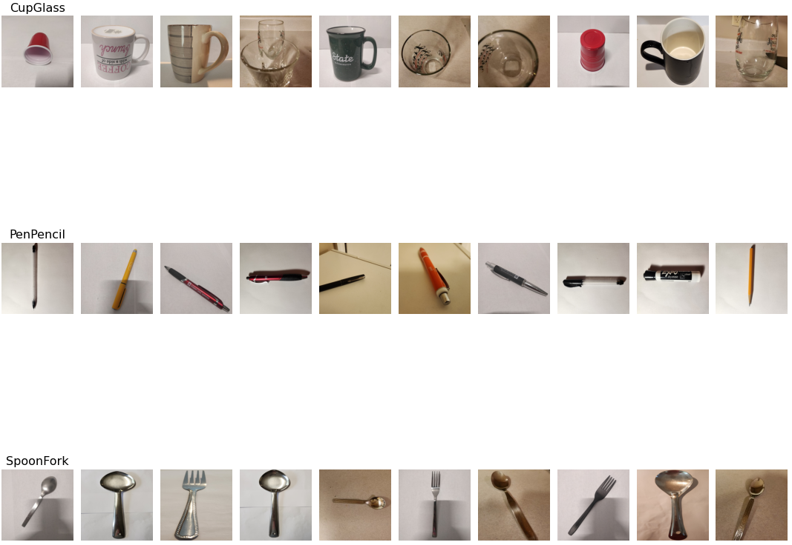

## IntelliSnap : Smart Object Classification

### Introduction.
This repository deals with building a object classifier using images organically curated of snapshots captured from day-to-day mobile camera.  

As far as the dataset is concerned, we have decided to capture images of daily household items such as Cups, Glasses, Pen, Pencil, Spoon, Fork.  

Our classifier model is based on Convoluted Neural Networks and classifies the objects into three categories such as CupGlass, PenPencil, SpoonFork.  

The dataset has been tested on a custom created CNN model as well as pre-trained VGG16 model.  

The custom CNN model has been fine tuned with various hyper-parameters and classification report has also been included along with validation accuracy.  

### Files.
•	`Dataset` – Folder contains images of all the three categories.  
•	`IntelliSnap.ipynb` – Contains the whole image pre-processing and CNN model.  

### Execution Instructions.
•	Clone the repo.  
•	Change the directory of the saved images in the `IntelliSnap.ipynb`.  
•	Execute all the cells in the python jupyter notebook.   

### Image Pre-processing
•	Pre-processing of the different images captured from different mobile cameras were performed to get a final dataset of uniform dimension images.  
•	Pillow python library was used to process these images.  
•	Built the input pipeline, including the appropriate preprocessing operations, and added data augmentation.  

### Custom CNN Model.
•	Adam Optimizer with Learning Rate 0.0001, Dropout and L2 regularizer has been used to prevent model from overfit.  

### VGG16 Model
•	Initially the pre-trained VGG16 model was used on our dataset to classify.  
•	After achieving a test accuracy of around 91% using default parameters, we applied some fine-tuning such as l2 regularization, dropout layer, unfreezing 3 layers and could see that the testing accuracy now increased to 97%.  

### Conclusion  

•	The Convolution Neural Network build from scratch gives an accuracy of 57.69% on the Testing set with a simple CNN layers without hyper parameter tuning.  

•	On tuning the hyper parameters such as Adam Optimizer with Learning rate as 0.0001, Dropout rate and adding a L2 regularizer to prevent overfit of the model, the final model gives an accuracy of 62.82% on the Testing dataset.

Thus after tuning the hyper parameters, better results are obtained.

•	The accuracy and loss v/s Epochs of the Training and the Validation shows fluctuations per epochs in both the Simple CNN model as well asthe one with hyper parameter tuning.

•	Lastly, the examples of images correctly classified and wrongly classified are shown for both the models.